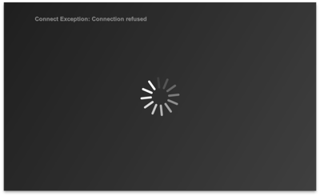

# Radiate

TeamCity build monitor. Run as a Windows **screensaver** or from the desktop.

It will auto detect your TeamCity projects and aggregate the builds to an overall RED or GREEN. Job done. See an introduction video [here](http://www.youtube.com/watch?v=uy5eP-1Pg3M)

  

### Configuration

Set the environment property `teamcity.host` and optionally `teamcity.port` (the port defaults to `8111` if you don't set it).

Currently, TeamCity must have guest login enabled (see instructions for [TeamCity 8](http://confluence.jetbrains.com/display/TCD8/Enabling+Guest+Login) and [TeamCity 7](http://confluence.jetbrains.com/display/TCD7/Enabling+Guest+Login)).

It reports builds form all projects on the TeamCity instance. Once you've run the app once, `config.yml` will be created in your `user.home` where you can prune the list of projects.

### Download

Download the .exe, .scr or executable jar from the [bad robot repository](http://robotooling.com/maven/bad/robot/radiate/).
