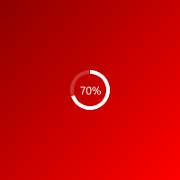
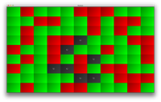
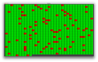

# Radiate

TeamCity build monitor. Run as a Windows **screensaver** or from the desktop.

It will auto detect your TeamCity projects and aggregate the builds to an overall RED or GREEN. Have a look on YouTube for [an introduction video](http://www.youtube.com/watch?v=ZMQn-J435Lk).

  

### Configuration

Set the environment property `TEAMCITY_HOST` and optionally `TEAMCITY_PORT` (the port defaults to `8111` if you don't set it).

Both TeamCity user and guest login are supported. To enable TeamCity guest login see instructions for [TeamCity 8](http://confluence.jetbrains.com/display/TCD8/Enabling+Guest+Login) and [TeamCity 7](http://confluence.jetbrains.com/display/TCD7/Enabling+Guest+Login)).

It reports builds form **all** projects on the TeamCity instance. Once you've run the app once, `config.yml` will be created in your `user.home` where you can prune the list of projects and change other settings.

### Usage

There are a few key you can use to control the application. Hit any of the following whilst running.

* **Esc** - quit
* **F11** or **m** - switch from desktop to screen saver mode (full screen)
* **F1** or **i** - toggle the console for additional information
* **cursor** - move screens left and right in a multiple monitor setup

A log will also be created in the `user.home` folder.

### Environment configurations

Radiate will try and bootstrap things with sensible defaults. Once started, the `config.yml` file is created with configuration and from that point out will override any environment variables. Environment variables are therefore a handy way to start the app with minimal configuration. The support variables are

Environment variable | Required | Example
--- | --- | ---
TEAMCITY_HOST | Required | http://localhost
TEAMCITY_PORT | Optional, defaults to 8111 | 8001
TEAMCITY_PASSWORD | Optional, defaults to guest auth | bob_fossil
TEAMCITY_USERNAME | Optional, defaults to guest auth | secret

### Download

Download the .exe, .scr or executable jar from the [bad robot repository](http://robotooling.com/maven/bad/robot/radiate/).

### Finer grained views

Work on an alternative views is underway to allow per project aggregation or per build type visualisation.

  